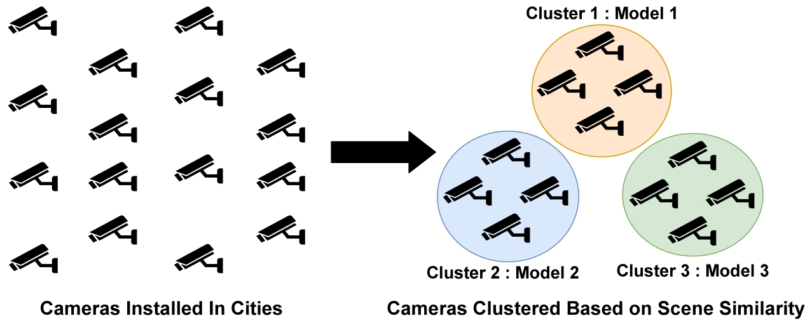

---

### Resources

+ [Short Paper](https://dl.acm.org/doi/10.1145/3636534.3695902)
<!-- + [Code](https://github.com/shubhamchdhary/TileClipper) -->

---

### Abstract

<p align="justify"> The proliferation of video analytics in applications like autonomous driving, traffic surveillance, and teleoperated vehicles requires on-premise (on edge) execution of deep learning models to meet latency requirements and curb bandwidth usage by limiting frequent offloading of inference tasks. However, constrained by the compute and power availability on the edge, a cheaper model is typically deployed. These shallower models have two major associated problems: 1) using the same model for all cameras/vehicles gives inconsistent accuracy, and 2) trained models are prone to data drift.
In this work, we propose to address these problems using two strategies. The first strategy is to intelligently assign individual models to each camera/vehicle by clustering the ones with similar visual scenes to reduce the number of allocated models. Second, to circumvent the data drift, we re-train the model assigned to the cluster, which undergoes accuracy deviation.</p>

---

### Papers
* S3 @ MobiCom'24

---

### Proposed Approach


---

### Citation

```BibTeX
@inproceedings{10.1145/3636534.3695902,
author = {Chaudhary, Shubham and Bhattacharya, Arani and Anand, Saket and Balasubramanian, Aruna},
title = {Scalable and Sustainable Video Analytics on Edge using Sensor Clustering},
year = {2024},
isbn = {9798400704895},
publisher = {Association for Computing Machinery},
address = {New York, NY, USA},
url = {https://doi.org/10.1145/3636534.3695902},
doi = {10.1145/3636534.3695902},

booktitle = {Proceedings of the 30th Annual International Conference on Mobile Computing and Networking},
pages = {2239–2241},
numpages = {3},
keywords = {video analytics, traffic surveillance, data drift, deep neural networks},
location = {Washington D.C., DC, USA},
series = {ACM MobiCom '24}
}
```

---
