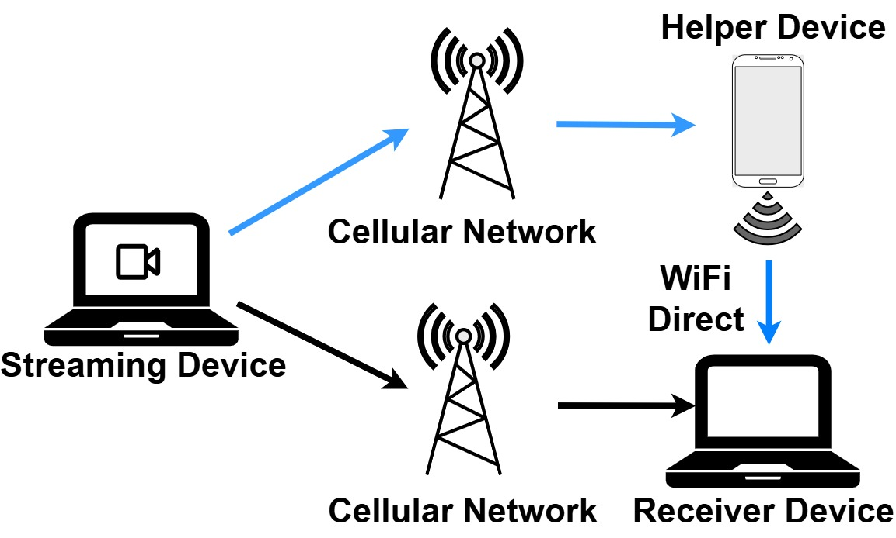
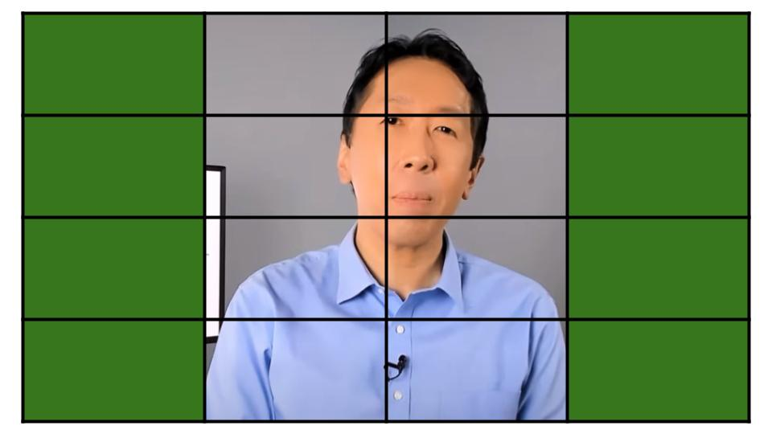
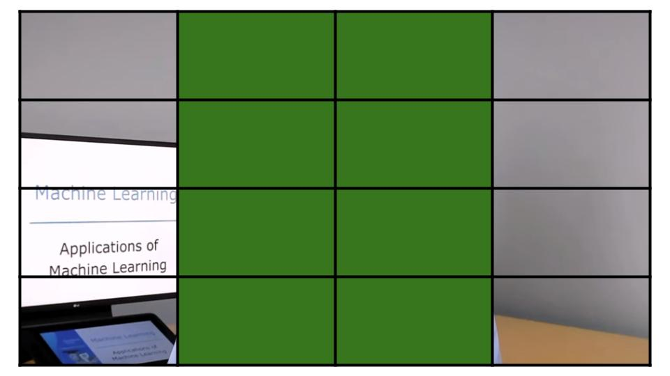
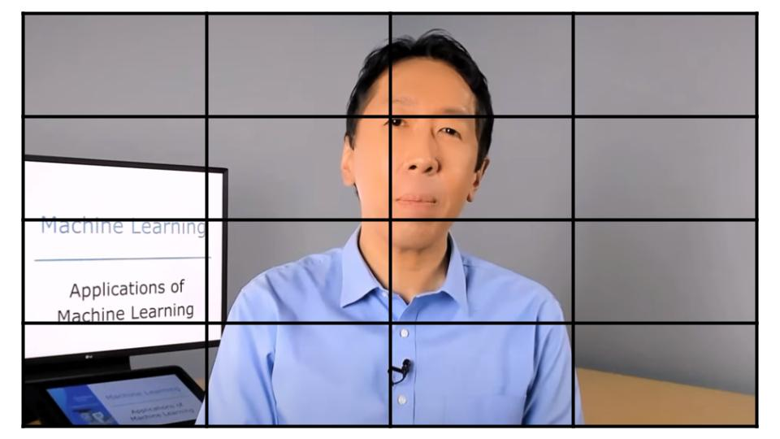
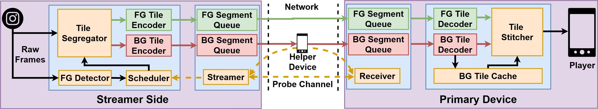

---

### Resources

+ [Full Paper](https://dl.acm.org/doi/10.1145/3712676.3714451)
+ [Short Paper](https://ieeexplore.ieee.org/abstract/document/10041371)
+ [Code](https://github.com/shubhamchdhary/COMPACT)

---

### Abstract

<p align="justify"> The growing popularity of live online classes, even in remote areas, stresses the need for a good and seamless quality of experience to enhance learning. However, these bandwidth-hungry applications challenge the current cellular networks to maintain consistent bandwidth and latency. In this work, we, therefore, propose using the collaboration of multiple devices with their individual cellular networks to support such live video streaming. We design a content-aware system Compact that splits video into foreground and background using video tiles (independently encoded spatial blocks) and streams them over different paths. Compact depends on its scheduler, which exhaustively searches for the best quality based on the network estimates. We extensively evaluate our system using network traces while walking and traveling on the bus or car. Compared to the single path, Compact manages to reduce the median stall and E2E lag by 70.6% and 28.57%, and the tail stall and lag by 83.9% and ≈ 80% on a bus trace. Furthermore, we performed a live experiment to test Compact on the actual cellular network.</p>

---

### Papers
* COMPACT @ ACM MMSys'25
* NATIVE @ COMSNETS'23

---

### COMPACT
##### Overview


##### Tile Stitching
 |  | 
:--:| :--: | :--:
**ForeGround Tiles**| **Background Tiles**|**Stitched Tiles**

##### Architecture


---

### Citation

```BibTeX
```bibtex
@inproceedings{compact,
author = {Chaudhary, Shubham and Mishra, Navneet and Gambhir, Keshav and Rajore, Tanmay and Bhattacharya, Arani and Maity, Mukulika},
title = {COMPACT: Content-aware Multipath Live Video Streaming for Online Classes using Video Tiles},
year = {2025},
isbn = {9798400714672},
publisher = {Association for Computing Machinery},
address = {New York, NY, USA},
url = {https://doi.org/10.1145/3712676.3714451},
doi = {10.1145/3712676.3714451},
booktitle = {Proceedings of the 16th ACM Multimedia Systems Conference},
pages = {201–213},
numpages = {13},
keywords = {multipath, live video streaming, video tiles, live online class},
location = {Stellenbosch, South Africa},
series = {MMSys '25}
}
```
---
