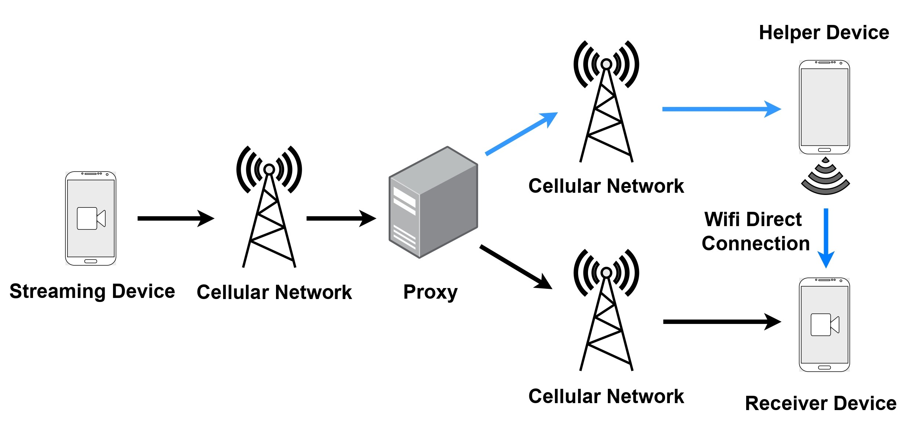

---

### Resources

+ [Short Paper](https://ieeexplore.ieee.org/abstract/document/10041371)
<!-- + [Code](https://github.com/shubhamchdhary/TileClipper) -->

---

### Abstract

<p align="justify"> The COVID-19 pandemic has forced most interactions to move to online space, starting from online lectures, conferences in hybrid mode, and work-from-home office works. Hence, it is essential for live video streaming to be reliable and provide a good quality of experience (QoE) to users. However, in large sections of the world, the cellular network is not reliable enough to be used for online participation in such events. To quantify this problem, we first measure the QoE in terms of lag, video resolution, and dropped calls on a popular video conferencing platform Google Meet over three different cellular ISPs in New Delhi, India. We observe significantly worse quality of experience metrics compared to a study recently performed in the US. To mitigate this problem, we propose NATIVE (Network Aggregation-based Tiled lIve Video strEaming), a system of aggregating the cellular network connectivity using a secondary or helper device in the vicinity trusted by the user. The implementation of NATIVE uses tiled encoding of video, where the video frames are divided into rectangular units known as tiles. All the tiles are divided into two subsets which are scheduled independently via the available network interfaces depending on its importance. The receiver device receives video segments from the two network paths and stitches back the tiles in them to play. We show the demo of NATIVE using two laptops and a cloud server where the server acts as a streamer.</p>

---

### Papers
* NATIVE @ COMSNETS'23

---

### NATIVE
##### Proposed Architecture


---

### Citation

```BibTeX
@INPROCEEDINGS{10041371,
  author={Gambhir, Keshav and Rajore, Tanmay and Chaudhary, Shubham and Jain, Taral and Gupta, Avishi and Maity, Mukulika and Bhattacharya, Arani},
  booktitle={2023 15th International Conference on COMmunication Systems & NETworkS (COMSNETS)}, 
  title={NATIVE: Network Aggregation based Tiled Live Video Streaming}, 
  year={2023},
  volume={},
  number={},
  pages={219-221},
  keywords={Cellular networks;Performance evaluation;Portable computers;Receivers;Streaming media;Particle measurements;Quality of experience},
  doi={10.1109/COMSNETS56262.2023.10041371}
}
```

---
