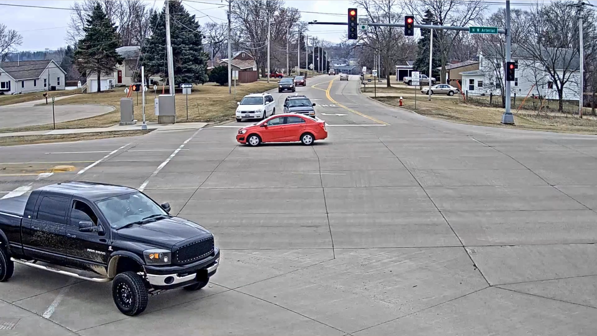
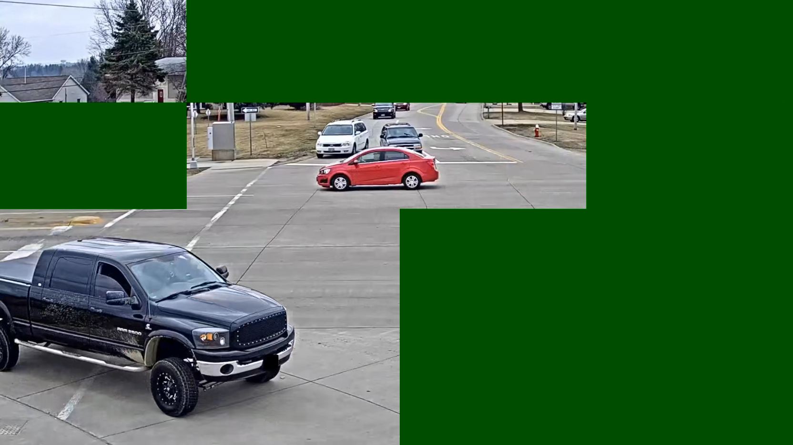
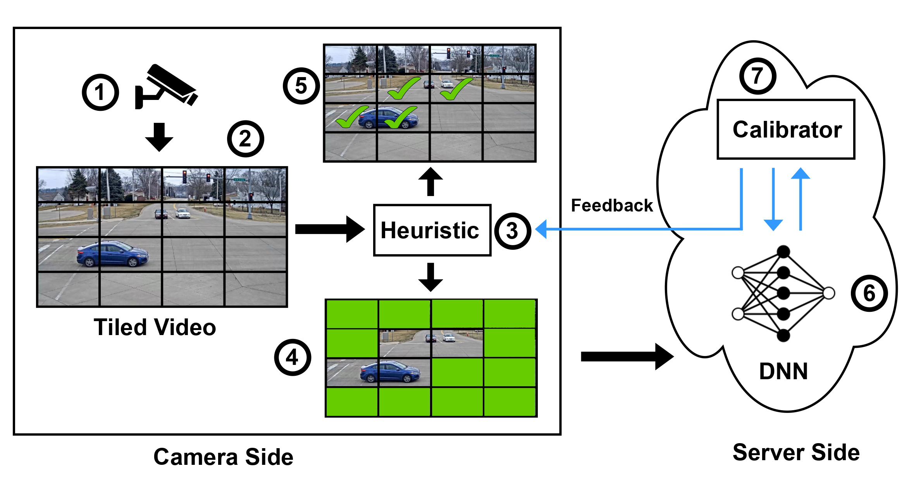

---

##### Resources

+ [Paper & Presentation](https://www.usenix.org/conference/atc24/presentation/chaudhary)
+ [Code](https://github.com/shubhamchdhary/TileClipper)

---

##### Abstract

With traffic surveillance increasingly used, thousands of cameras on roads send video feeds to cloud servers to run computer vision algorithms, requiring high bandwidth. State-of-the-art techniques reduce the bandwidth requirement by either sending a  limited number of frames/pixels/regions or relying on re-encoding the important parts of the video. This imposes significant overhead on both the camera side and server side compute as re-encoding is expensive.  In this work, we propose TileClipper, a system that utilizes tile sampling, where a limited number of rectangular areas within the frames, known as tiles, are sent to the server. 

TileClipper selects the tiles adaptively by utilizing its correlation with the tile bitrates.
We evaluate TileClipper on different datasets having 55 videos in total to show that, on average, our technique reduces approx.22% of data sent to the cloud while providing a detection accuracy of 92% with minimal calibration and compute compared to prior works. We show real-time tile filtering of TileClipper even on cheap edge devices like Raspberry Pi 4 and nVidia Jetson Nano. We further create a live deployment of TileClipper to show that it provides over 87% detection accuracy and over 55% bandwidth savings.

 | 
:--:| :--:
**Before Tile Pruning**| **After Tile Pruning**
---

##### Papers


---

##### Tile Pruning


---

##### Citation

```BibTeX
@inproceedings {298605,
author = {Shubham Chaudhary and Aryan Taneja and Anjali Singh and Purbasha Roy and Sohum Sikdar and Mukulika Maity and Arani Bhattacharya},
title = {{TileClipper}: Lightweight Selection of Regions of Interest from Videos for Traffic Surveillance},
booktitle = {2024 USENIX Annual Technical Conference (USENIX ATC 24)},
year = {2024},
isbn = {978-1-939133-41-0},
address = {Santa Clara, CA},
pages = {967--984},
url = {https://www.usenix.org/conference/atc24/presentation/chaudhary},
publisher = {USENIX Association},
month = jul
}
```

---
